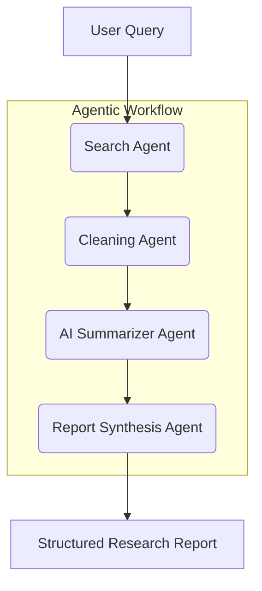

# Milestone 2: Agentic AI Research Assistant

## Overview
This milestone extends the traditional NLP analysis system into a fully autonomous **Agentic AI Research Assistant**. Unlike Milestone 1, which processed static documents using unsupervised learning, this system uses **LangGraph** to coordinate multiple specialized agents that retrieve information, reason across sources, and generate structured research reports.

---

## 🏗️ System Architecture (Agentic Pipeline)

The system is built as a cyclic directed graph using **LangGraph**. Each node represents a specific functional agent.



### 1. Search Agent
- **Tool:** DuckDuckGo Search (DDGS) / Tavily API.
- **Function:** Performs web searches to retrieve real-time data from the internet.

### 2. Cleaning Agent
- **Function:** Processes raw search results, removes HTML clutter, and extracts relevant text snippets for processing.

### 3. AI Summarizer Agent
- **Model:** `facebook/bart-large-cnn` (Open-source via Hugging Face).
- **Function:** Generates extractive and abstractive summaries for each source to maintain high information density.

### 4. Report Synthesis Agent
- **Function:** Aggregates all summaries and generates a structured research report containing a Title, Abstract, Key Findings, Sources, and Conclusion.

---

## 🛠️ Tech Stack

- **Agent Orchestration:** [LangGraph](https://github.com/langchain-ai/langgraph)
- **LLM / NLP:** [Transformers](https://huggingface.co/docs/transformers/index) (`BART-Large-CNN`)
- **Search Engine:** `duckduckgo-search`
- **UI Framework:** Streamlit
- **State Management:** LangGraph State (Dictionary-based memory)

---

## 🚀 Key Features

- **Open-ended Queries:** Accepts any research topic (e.g., "Impact of Quantum Computing on Cybersecurity").
- **Autonomous Retrieval:** No need for local PDFs; the agent finds sources on the web.
- **Structured Output:** Automatically formats data into a professional-grade research report.
- **Error Handling:** Graceful fallback when search results are insufficient or models fail.

---

## 📂 Project Structure (Milestone 2)

```text
    agents/
    ├── graph.py       # Core LangGraph implementation
    ├── search.py      # DuckDuckGo search integration
    ├── retriever.py   # Text cleaning and preprocessing
    ├── llm.py         # Hugging Face BART summarization
    ├── report.py      # Structured report generation logic
    
    app_milestone2.py  # Streamlit UI for Agentic Assistant
    requirements.txt   # Updated dependencies
```

---

## 📝 How to Run

### 1. Install New Dependencies
Milestone 2 requires additional libraries for agents and LLMs:
```bash
pip install langgraph duckduckgo-search transformers torch
```

### 2. Launch the Agentic UI
```bash
streamlit run app_milestone2.py
```

---

## ⚖️ Limitations of Traditional vs Agentic Approach

| Feature | Milestone 1 (Traditional) | Milestone 2 (Agentic) |
| :--- | :--- | :--- |
| **Data Source** | Static documents (arXiv CSV) | Real-time Web Search |
| **Workflow** | Linear Pipeline | Graph-based Agentic Workflow |
| **Reasoning** | Clustering / TF-IDF | LLM-based Summarization |
| **Autonomy** | Manual preprocessing | Autonomous information retrieval |
| **Output** | Keyword clusters | Structured Narrative Reports |

---

## 🎯 Deliverables Summary
- **Agentic Workflow:** Fully implemented in `agents/graph.py`.
- **UI:** Interactive dashboard in `app_milestone2.py`.
- **Search:** Dynamic retrieval in `agents/search.py`.
- **Reporting:** Automated synthesis in `agents/report.py`.
